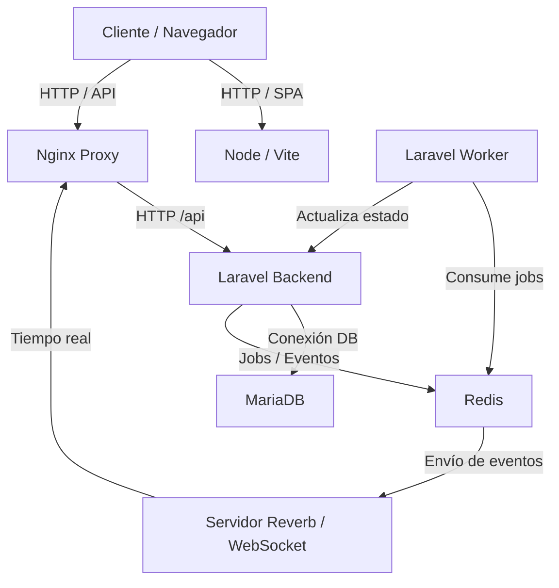

# Lupis Insani

Versión web del juego *Hombres Lobo de Castronegro*, desarrollada con arquitectura basada en Laravel, Vite y Docker. El proyecto incluye backend con colas y WebSockets, frontend en TypeScript y un entorno completamente dockerizado para facilitar el desarrollo.

---

## Tecnologías utilizadas

### Backend


### Frontend


### Infraestructura


---

## Servicios del proyecto

| Servicio  | Puerto | Descripción                               |
| --------- | ------ | ----------------------------------------- |
| `laravel` | 8000   | API HTTP                                  |
| `reverb`  | 8080   | WebSockets                                |
| `worker`  | —      | Procesamiento de colas y lógica del juego |
| `node`    | 5173   | Servidor de desarrollo Vite               |
| `nginx`   | 80     | Proxy inverso                             |
| `mariadb` | 3306   | Base de datos                             |
| `redis`   | 6379   | Sistema de colas/cache                    |

---

## Instalación

### 1. Clonar el repositorio

```bash
git clone https://github.com/GsuDev/Desafio-Lupis-Insani.git
cd lupis-insani
```

---

## Puesta en marcha

### Mac / Linux

El proyecto dispone de un `Makefile` con comandos básicos:

```bash
make start   # Inicia los contenedores Docker
make stop    # Detiene todos los contenedores
```

---

### Windows

En la raíz se incluye `manage.bat`. Comandos disponibles:

```powershell
manage.bat start   # Inicia los contenedores
manage.bat stop    # Detiene los contenedores
```

---

## Estructura del proyecto

```
/backend              # Laravel API, WebSockets y Worker
/frontend             # Vite + TypeScript Vanilla
/nginx                # Configuración de Nginx
docker-compose.yml    # Definición de servicios
manage.bat            # Scripts para Windows
Makefile              # Scripts para Mac/Linux
```

---

## Docker

Ejecución manual del entorno:

```bash
docker compose up -d --build
```

Detener el entorno y eliminar volúmenes:

```bash
docker compose down -v
```

---

## Arquitectura del sistema



---

## Contribución

Flujo recomendado:

1. Crear rama desde `dev`.
2. Aplicar cambios y realizar commits.
3. Abrir una Pull Request.
4. Revisar con el equipo.
5. Fusionar en `dev` tras aprobación.

---

## Licencia

Licencia pendiente de definir.
